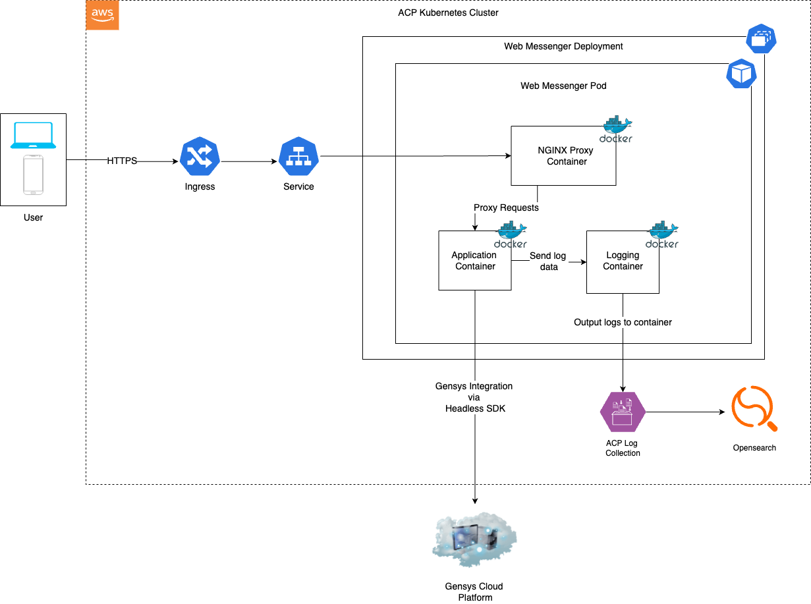

# Visa Web Messenger

* [Introduction](#introduction)
* [Service Architecture](#service-architecture)
* [Service Flow](#service-flow)
* [Technical Overview](./docs/technical-overview.md)
* [Genesys Integration](./docs/genesys-overview.md)
* [Developer Guide](./docs/dev.md)
* [Adding a New Web Chat](#adding-a-new-web-chat)
* [Contributing](#contributing)


## Introduction 

Home Office service for visa web messenger. This service provides a chat bot style services for public use.

The messenger uses the core [hof-genesys-chat-component](https://www.npmjs.com/package/hof-genesys-chat-component).

The application is hosted within the ACP platform, deployed onto Kubernetes infrastructure.

## Service Architecture



## Service Flow

1. The end user accesses the service via their browser. 
2. On initial load of the application, the service fetches and initialises the [Genesys Headless SDK](https://developer.genesys.cloud/commdigital/digital/webmessaging/messengersdk/messengerHeadlessmodeSDK). 
3. Whilst this is happening, a loading spinner is shown to indicate further loading is taking place. 
4. Once the SDK is loaded, the application will begin a sequence of actions to ensure the SDK is ready and subscribe to a number of core SDK events (see [genesys overview](./docs/genesys-overview.md) for more detail).
5. Once the application is deemed ready, the chat components will be loaded into the user browser, replacing the loading spinner. The user will then be able to interact with the digital assistant or live agent through the use of the chat form.

## Technical Overview

See the [technical overview](./docs/technical-overview.md)

## Developer Guide

This guide shows how to run `visa-web-messenger` locally for development, how to provide runtime environment values, and how to run the built image locally so you can test behaviour that's close to production.

### Prerequisites

- Node (the currently pinned base image is [hof-nodejs 20](https://quay.io/repository/ukhomeofficedigital/hof-nodejs?tab=tags&tag=20.19.0-alpine3.21-v2@sha256:ab9686c7cf77bab94ab32c1c0e262b2a5242c2cbff61b0bbb3f62610b4f2e706)). Use the project's node manager or the official Node installation.
- Yarn
- Docker (when testing container builds locally).

### Create a local env.json (runtime config)

The application loads runtime configuration from `env.json` (fetched by the client before React mounts). For local dev, create a file at the project root named `env.json` with keys the app expects.

Example `env.json`:

```json
{
  "VISA_DEPLOYMENT_ID": "REPLACE_ME",
  "GENESYS_ENVIRONMENT": "REPLACE_ME",
  "GOOGLE_TAG_MANAGER_ID": "REPLACE_ME",
  "ENABLE_ANALYTICS": false,
  "LOG_ENDPOINT": "REPLACE_ME"
}
```

> Note: Non-prod values can be found in Keybase (`visa-wm-env.json`), a senior developer on the team can help you to find this if you're unfamiliar with Keybase.

### Run in development mode (Vite)

1. Install dependencies:

```bash
yarn install
```

2. Ensure `env.json` exists at the project root (see above). Vite will serve files from project root so the client can fetch `/env.json`.

3. Start the dev server:

```bash
yarn dev
# opens on http://localhost:3000
```

Behaviour:

- `src/index.js` calls `loadEnvironmentConfig()` which fetches `/env.json`. The app will not mount until the env is loaded.
- To quickly check that `env.json` is accessible, open `http://localhost:3000/env.json` in the browser. If fetch fails the console will show an error and the app will not bootstrap.

### Serve built assets locally (production-like)

If you want to build and serve the static files like production (so `generate-env.sh` or nginx behaviour can be tested), follow these steps:

1. Build the production artifact:

```bash
yarn build
# outputs to ./dist
```

2. Copy your `env.json` into `dist/` (or ensure `generate-env.sh` will create it when running the container). For a local static server, put `env.json` into `dist/`:

```bash
cp env.json dist/env.json
```

3. Serve `dist/` with a simple static server (you can use `npx serve` or python):

```bash
npx serve -s dist -l 8080
# or
python3 -m http.server --directory dist 8080
```

Then open `http://localhost:8080` to verify the built app loads and reads `env.json`.

### Run the Docker image locally (test runtime env injection)

This lets you exercise `generate-env.sh` which writes `env.json` from env vars at container startup.

1. Build the image (from project root):

```bash
docker build -t visa-web-messenger:local .
```

2. Create a `.env` file with keys required by `generate-env.sh` (or pass env vars directly to `docker run`). Example `.env`:

```ini
VISA_DEPLOYMENT_ID=REPLACE_ME
GENESYS_ENVIRONMENT=REPLACE_ME
GOOGLE_TAG_MANAGER_ID=REPLACE_ME
ENABLE_ANALYTICS=false
LOG_ENDPOINT=REPLACE_ME
```

> NOTE: the file doesn't have to be named `.env` it's just to pass the environment variables to the docker environment. Again the non-prod values can be found in keybase (`visa-wm-env.json`).

3. Run the container with the env file and port mapping:

```bash
docker run --rm --env-file .env -p 8000:80 visa-web-messenger:local
```

### Tests and linting

- Run unit tests with coverage:

```bash
yarn test
```

- Run ESLint:

```bash
yarn lint
yarn lint:fix
```

### Debugging tips

- env.json fetch failures: open the browser devtools Network tab and check the `/env.json` request and response. If it returns 404 or 500 the app will throw and not mount.
- Vite (dev): source maps are enabled by default — use the browser devtools to set breakpoints in app sources.

### Common issues

- Forgot `env.json` — app won't start. Ensure `env.json` is served at `/env.json` before the app's JS runs.
- Port collisions — dev server runs on 3000 by default. Production nginx listens on 80 inside the container and is mapped to the host port you choose.

## Contributing

Follow the [Pull Request Template](./pull-request-template.md) when raising a pull request.
